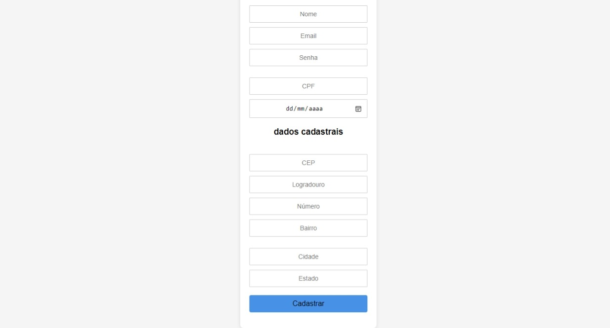

<h1 align="center"> dados de cadastro completo!</h1>

 # Projeto de Cadastro

Este projeto é um formulário de cadastro simples, onde os usuários podem inserir seus dados pessoais e de contato. O objetivo é oferecer uma interface limpa e fácil de usar.

## Tecnologias Utilizadas

- HTML
- CSS
- JavaScript
- Bootstrap

## Estrutura do Projeto

- `index.html`: Contém a estrutura do formulário de cadastro.
- `main.css`: Estilos para o formulário e seus elementos.
- `cadastro.js`: Lógica JavaScript (ainda a ser implementada).

## Funcionalidades

- Campos para nome, email, senha, CPF, data de nascimento e endereço.
- Validação básica (a ser implementada no `cadastro.js`).
- Design responsivo e acessível.

# colaborador e autor
 [ Maria Yanagui  ](https://github.com/mariayanagui) |  [ Guilherme Serfim ](https://github.com/Guilimas2) |  [ ](h) 

